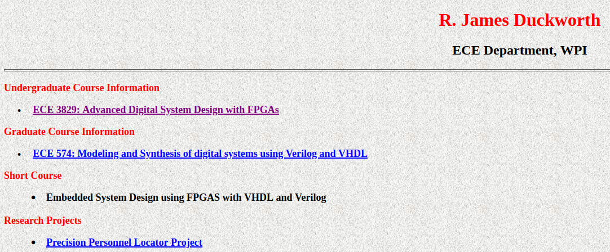
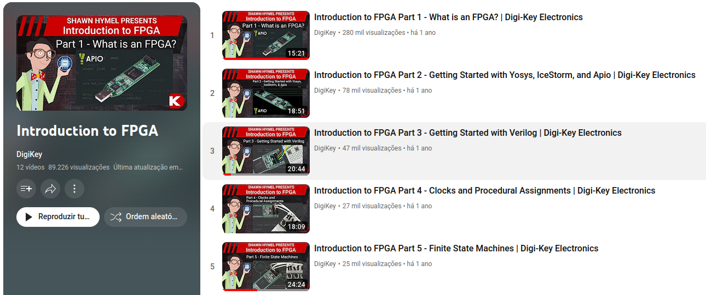

# FPGA-Resources
Projeto de recursos para aprendizagem de FPGA


## Recursos de aprendizado 

**Listas de tutoriais** 


ECE 3829: Advanced Digital System Design with FPGAs  
https://users.wpi.edu/~rjduck/
<div align="left">
    
</div>


FPGA project with Prof Mughal  
https://www.youtube.com/watch?v=tOwMmBI_XNo&list=PLqFzqzGMquZxGdkwBd9C2RSLIIlS5IxcK&index=1
<div align="left">
    
</div>

Digikey - Introduction to FPGA  
https://www.youtube.com/playlist?list=PLEBQazB0HUyT1WmMONxRZn9NmQ_9CIKhb

<div align="left">
    
</div>

FPGA for Beginners - Electro Mullet  VHDL  
https://www.youtube.com/watch?v=V0VtzxQstJg&list=PLASHf7jviOmoArEq4TY1TlRfhttdddGWC

<div align="left">
    
</div>

FPGA Programming with Verilog & Basys3 - Dr Selim  
https://www.youtube.com/watch?v=VtbPexCocVo&list=PLbFgDf51ZkCEJb9MvxKIs-0q2obouwf-f 

<div align="left">
    
</div>

Xilinx FPGA programming tutorials - Simple Tutorials for Embedded Systems  
https://www.youtube.com/watch?v=DIOll3P65hg&list=PLqOe1_kmWOx0oLBHI8O8WNO0QRjU8nzDD

<div align="left">
    
</div>

State Machines - FPGA Discovery  
https://www.youtube.com/watch?v=EgK-M-zJ-1c&list=PLrx9yOWXx5lad0LKRLd4YwTT6QcSS5eyj

<div align="left">
    
</div>


**Videos individuais** 

Pulse Width Modulation (PWM) in FPGA, Verilog, and Vivado - Make External Breadboard LED Blink - Aleksandar Haber  
https://www.youtube.com/watch?v=tdFaycLh0po  
https://aleksandarhaber.com/simple-approach-to-generate-pulse-width-modulation-pwm-signals-on-fpga-using-verilog-breadboard-led-blink/  


**Tutoriais** 

Alchitry - tutoriais basicos   
https://alchitry.com/background

Digilent - paginas de help  
https://digilent.com/reference/programmable-logic/guides/getting-started-with-ipi


Digilent Pmod™ Peripheral Modules  
http://www.mouser.ca/new/digilent/digilent-peripheral-modules


Getting Started With Lattice IceStick FPGA Using Open Source Tools on MacOS  
https://appcodelabs.com/getting-started-with-lattice-icestick-using-open-source-tools-on-macos-linux

Intro to Verilog - an MIT presentation   
http://web.mit.edu/6.111/www/f2016/handouts/L03_4.pdf

Getting Started with Artix-7 Digilent Basys3 Board - University f Hawaii   
http://ee.hawaii.edu/~sasaki/EE361/Fall15/Lab/TutorialArtix-7Basys3.pdf


**Artigos**   

FPGA for deep learning   
https://www.run.ai/guides/gpu-deep-learning/fpga-for-deep-learning

FPGAs for AI and Machine Learning  
https://circuitcellar.com/research-design-hub/basics-of-design/fpgas-for-ai-and-machine-learning/


## APIO - tool for synthesizing and programming FPGAs 

APIO: https://github.com/FPGAwars/apio

Open source ecosystem for open FPGA boards

Apio (pronounced [ˈa.pjo]) is a multiplatform toolbox, with static pre-built packages, project configuration tools and easy command interface to verify, synthesize, simulate and upload verilog designs.

### Instalação
```bash
# Instalação do APIO: 
python3 -m pip install apio==0.6.7

apio --version

apio install --all 

# conectar a board e executar: 
apio system --lsftdi 

# Lista projetos de exemplo que vem com apio
apio examples -l

# Checkout do projeto leds
apio examples-d icestick/leds


# Configura a board que sera utilizada. Lista as boards disponiveis:  
apio boards --list 

# Com a board selecionada, inicializa: 
apio init --board icestick 

# Executa verificacao
apio verify

# Simulation
apio sim 

# Build 
apio build 

# Upload 
apio upload 

```

Troubleshooting

```bash 
/home/torjc01/.apio
/home/torjc01/.apio
/home/torjc01/.apio
Error: board icestick not connected

```
É necessário verificar a descrição com a qual o icestick foi identificado pelo host. 

apio system --lsftdi

/home/torjc01/.apio
Number of FTDI devices found: 1
Checking device: 0
Manufacturer: FTDI, Description: Dual RS232-HS

Editar o arquivo `~/.local/lib/python3.10/site-packages/apio/resources/boards.json`, localizar o icestick, e copiar a descrição localizada acima para icestick.ftdi.desc

Desconectar o dispositivo, reconectá-lo e refazer o comando apio upload. 


Erro: 
gtkwave: symbol lookup error: /snap/core20/current/lib/x86_64-linux-gnu/libpthread.so.0: undefined symbol: __libc_pthread_init, version GLIBC_PRIVATE
scons: *** [sim] Error 127

Problema se apresenta no Visual Studio Code. Execute a simulacao no terminal. 

exportar scons para a variavel SCONS_LIB_DIR

```
export SCONS_LIB_DIR=/home/torjc01/.local/bin/scons
```

### Referencias APIO


- APIO readthedocs: https://apiodoc.readthedocs.io/en/stable/
- YosysHQ: https://yosyshq.net - Yosys Open Synthesis Suite : framework de systesis de Verilog 
- nextpnr: https://github.com/YosysHQ/nextpnr : Vendor neurtal place and route tool 
- Project Icestorm: IcePack/IceUnpack, IceProg
- IceStudio: https://github.com/FPGAwars/icestudio
- Lattice Semi - https://www.latticesemi.com/iCE40
- iCEStick User Manual: 
https://www.google.com/url?sa=t&rct=j&q=&esrc=s&source=web&cd=&ved=2ahUKEwith8fj36-AAxWdkIkEHfoWBfkQFnoECBgQAQ&url=https%3A%2F%2Fwww.latticesemi.com%2F~%2Fmedia%2FLatticeSemi%2FDocuments%2FUserManuals%2FEI%2Ficestickusermanual.pdf&usg=AOvVaw3QaCjB1FndCINPZO6z0wiW&opi=89978449


## Troubleshoot

**Server hardware not found:**   

https://support.xilinx.com/s/question/0D52E00006hpRJrSAM/basys3-not-recognized-by-vivado-20202?language=en_US

