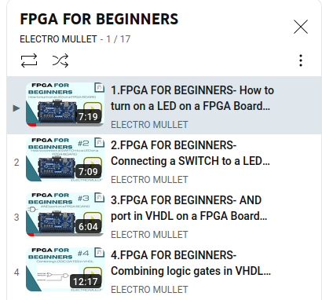
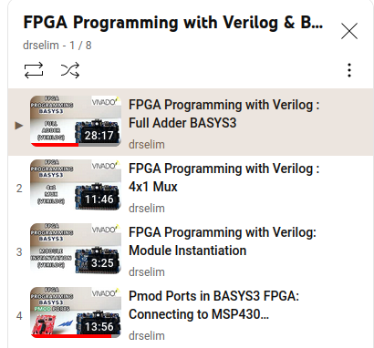
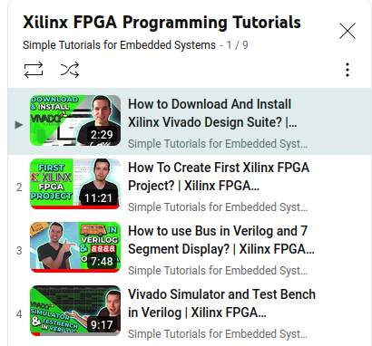
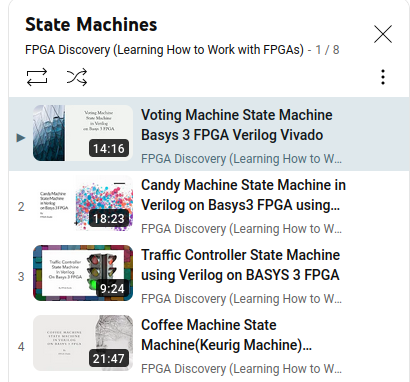

# FPGA-Resources
Projeto de recursos para aprendizagem de FPGA

## Recursos de aprendizado 

**Listas de tutoriais** 

FPGA for Beginners - Electro Mullet  
https://www.youtube.com/watch?v=V0VtzxQstJg&list=PLASHf7jviOmoArEq4TY1TlRfhttdddGWC

    

FPGA Programming with Verilog & Basys3 - Dr Selim  
https://www.youtube.com/watch?v=VtbPexCocVo&list=PLbFgDf51ZkCEJb9MvxKIs-0q2obouwf-f 

    

Xilinx FPGA programming tutorials - Simple Tutorials for Embedded Systems  
https://www.youtube.com/watch?v=DIOll3P65hg&list=PLqOe1_kmWOx0oLBHI8O8WNO0QRjU8nzDD

    

State Machines - FPGA Discovery  
https://www.youtube.com/watch?v=EgK-M-zJ-1c&list=PLrx9yOWXx5lad0LKRLd4YwTT6QcSS5eyj

    

**Videos individuais** 

Pulse Width Modulation (PWM) in FPGA, Verilog, and Vivado - Make External Breadboard LED Blink - Aleksandar Haber  
https://www.youtube.com/watch?v=tdFaycLh0po  
https://aleksandarhaber.com/simple-approach-to-generate-pulse-width-modulation-pwm-signals-on-fpga-using-verilog-breadboard-led-blink/  

**Tutoriais** 

Alchitry - tutoriais basicos   
https://alchitry.com/background

Digilent - paginas de help  
https://digilent.com/reference/programmable-logic/guides/getting-started-with-ipi

## Troubleshoot

**Server hardware not found:**   

https://support.xilinx.com/s/question/0D52E00006hpRJrSAM/basys3-not-recognized-by-vivado-20202?language=en_US

